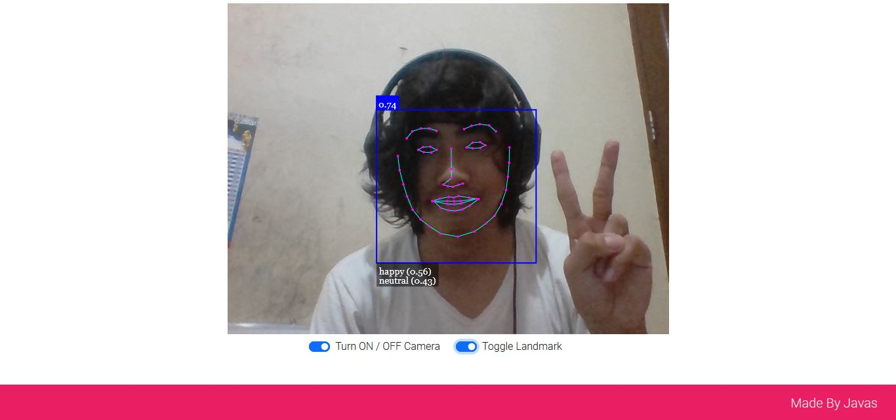
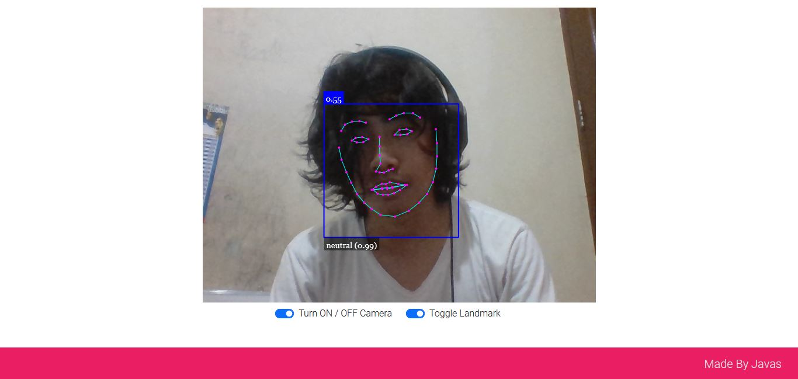

<h1 align="center">Aplikasi Face Recognition Webcam</h1>
<h3 align="center">Build with Vue 3</h3>

<p></p>

<p></p>


## Deskripsi
<p> Aplikasi ini saya buat untuk mencoba menyambungkan face api dengan aplikasi Vue JS saya 😄 jika kalian ingin mencoba mengembangkannya, silahkan dinikmati 🥰 </p>

## Live Demo
<h4>https://v1-shappy.digitalinteraktif.com/</h4>

## Setup Projek
<p>Silahkan dibuka terlebih dahulu terminalnya<p>
 
```
npm install || Menginstall package Node Modules
npm run serve || Menjalankan server Vue JS
```

<h3 align="center"> Selamat Mencoba 😸 </h3>